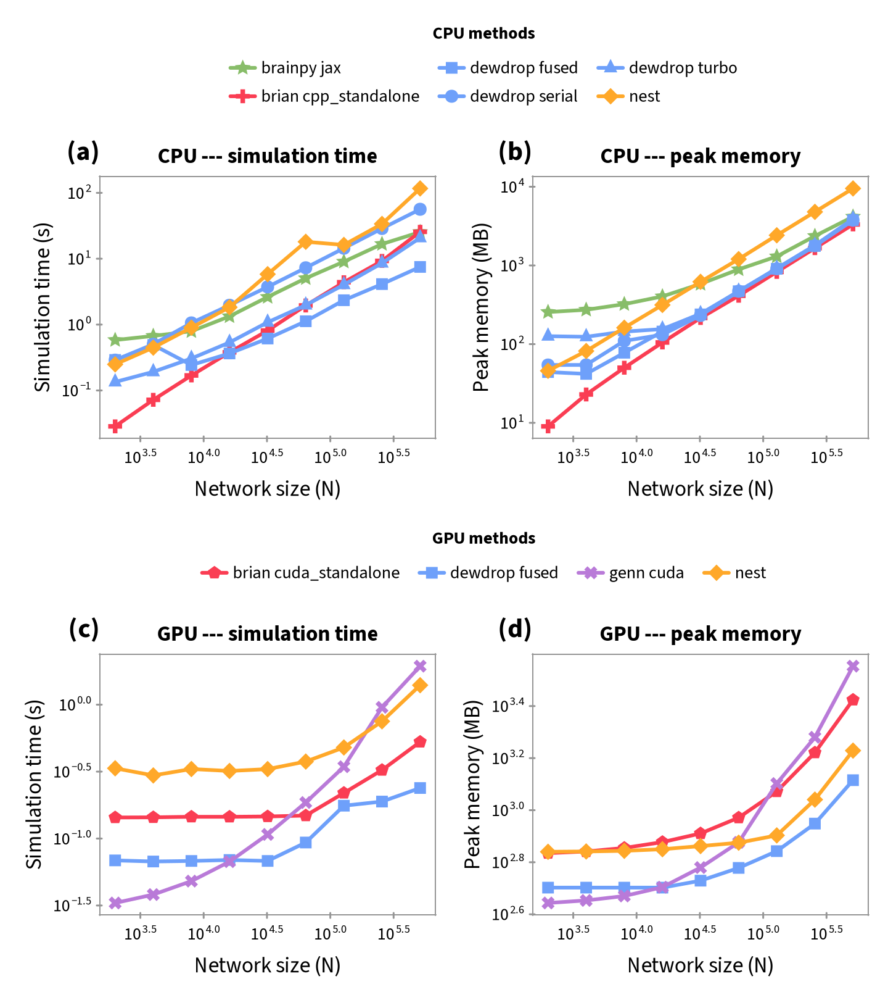

# Dewdrop

[](https://github.com/brendanjohnharris/Dewdrop.jl/actions/workflows/CI.yml?query=branch%3Amain)
[](https://codecov.io/gh/brendanjohnharris/Dewdrop.jl)

[](https://github.com/JuliaTesting/Aqua.jl)
[](https://github.com/aviatesk/JET.jl)


A GPU-aware spiking neural network simulator for Julia.

Dewdrop ports and consolidates ideas from gold-standard simulators (Brian2, NEST, BrainPy) into a fast, fixed-step, struct-of-arrays engine that's fully Julia.

## Quick start

```julia
using Dewdrop

# a leaky integrate-and-fire model
m = LIF(; τ = 20.0, EL = -70.0, Vθ = -50.0, Vr = -60.0, R = 100.0, tref = 2.0)

# 64 units driven by a constant current
prob = DewdropNetwork(m, 64; input = 0.5, tspan = (0.0, 1000.0))
sol  = solve(prob, FixedStep(0.1))
firing_rate(sol)
```

A connected network adds a `Projection` (synapse model + connectivity) and, optionally, an
external `PoissonDrive`:

```julia
N, NE, J, g = 1000, 800, 0.1, 5.0      # 800 E, 200 I; inhibition g× stronger
conn  = fixed_prob(CPU(), N, N, 0.1; weight = pre -> pre ≤ NE ? J : -g*J, delay = 15, seed = UInt64(1))
prob  = DewdropNetwork(m, N; input = 0.0, tspan = (0.0, 600.0),
                       projection = Projection(DeltaSynapse(), conn),
                       drive = PoissonDrive(; rate = 6.0, weight = J, seed = UInt64(2)))
sol   = solve(prob, FixedStep(0.1); record = (spikes = Spikes(),))
times, ids = raster(sol)
```

## Status

Experimental, but broad. Implemented and tested:

- **Neurons**: LIF (exact subthreshold propagator), AdaptLIF, AdEx, FNSNeuron; per-neuron
  `Heterogeneous` parameters and mixed-type `MultiModel` populations; custom models via the
  `@neuron` macro.
- **Synapses**: current-based (CUBA), delta (voltage-jump), conductance-based (COBA),
  dual-exponential COBA, and a frozen-current COBA variant; per-synapse heterogeneous delays.
- **Connectivity**: fixed-probability and spatial (distance-kernel / top-k) connectomes over
  point positions, with periodic boundaries and narrow (Int32) index options.
- **Drive & noise**: counter-based (reproducible) RNG, per-neuron Poisson drive, streaming
  Poisson sources, and an exact Ornstein--Uhlenbeck `WhiteNoise` SDE term.
- **Plasticity**: event-driven STDP (mutable weights + traces).
- **Engine**: fixed-step `CommonSolve` interface with pluggable execution backends
  (`Serial`/`Fused`/`Turbo`/`Differentiable`, chosen by `Auto`), a CUDA GPU path via a fused
  megakernel, and ensemble + block-diagonal batching.
- **Outputs**: opt-in windowed monitors (`Trace`/`Spikes`/`Aggregate`/`Probe`), named
  subpopulations (`sol[:E]`), `Unitful` inputs, labelled
  `TimeseriesBase` outputs, and host-side statistical observables.

Currently validated against the analytic LIF f-I curve and the Brunel (2000) and Vogels--Abbott regimes, and
cross-checked spike-for-spike against Brian2/brian2cuda, NEST/NEST-GPU, GeNN, and BrainPy. The
design is CPU-first with GPU-readiness enforced in CI (via `JLArrays` + `allowscalar(false)`); the
test suite is Aqua- and JET-clean.

See the [documentation](https://brendanjohnharris.github.io/Dewdrop.jl/dev) for a full guide.

## Benchmarks

On an identical recurrent E/I AdEx network (same connectome, verified statistics), Dewdrop's `Fused`
backend is the **fastest CPU simulator at scale** (3.4× faster than Brian2's compiled C++ and 15.6×
faster than NEST at N=512k) and the **fastest on the GPU** (2.2× brian2cuda, 8× GeNN), while staying
competitive with both at small sizes. Full methodology and tables are in the
[benchmarks documentation](https://brendanjohnharris.github.io/Dewdrop.jl/dev/benchmarks).

